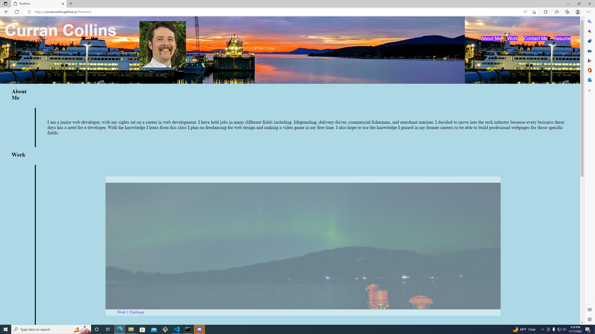

# Portfolio

## Description

I started this project with the intent of creating a portfolio for my future work.  The goal was to use HTML and CSS to create a clean easy to navigate webpage.  I kept the CSS in the order that I worked on it so I could follow it down the HTML.  I learned that it can take a lot of trouble shooting to get the webpage to appear how you want to.

## Usage

active webpage link:
https://currancollins.github.io/Portfolio/

The use of this project was to show that I understand how HTML and CSS should flow and look for easier review.

